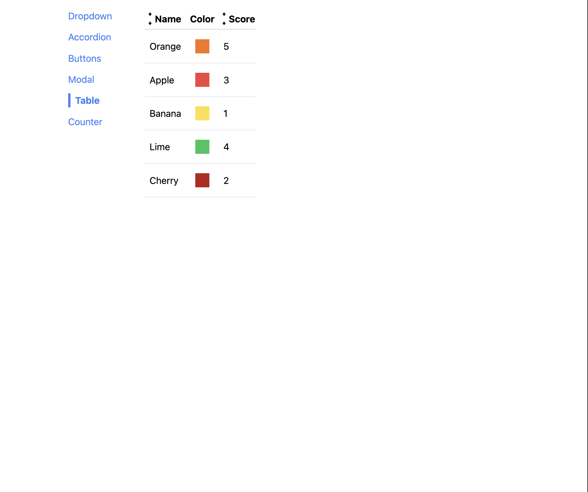

# React-components-examples 

  ## Description

  This is a simple React app with several reusable components (buttons, accordion, dropdown, modal, table, counter) and work with the react state framework.  This was built with React and TailwindCSS.
  
  Screenshot below:
  
  

  ## Table of Contents
  
  - [Installation](#installation)
  - [Usage](#usage)
  - [License](#license)
  - [Contributing](#contributing)
  - [Tests](#tests)
  - [Questions](#questions)
  
  ## Installation
  
  npm install
  
  ## Usage
  
  npm start

  ## License
This application is covered under the MIT License.
 For more information: https://opensource.org/licenses/MIT
  
  ## Contributing
  N/A
  
  ## Tests
  N/A

  ## Questions
  Contact Info 
  GitHub user name: BillStephens2022 
  Link to GitHub profile: https://github.com/BillStephens2022 
  Email: stephensbill17@gmail.com